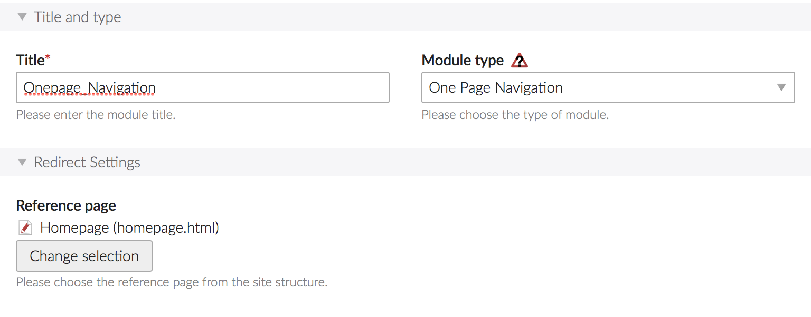
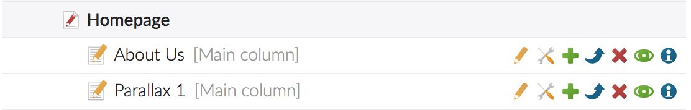
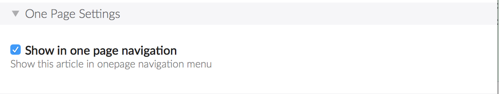

# Dokumentation

Das onepage-bundle fügt das Module  *"One Page Navigation"* zu den bestehenden Contao Modulen hinzu. Das One Page Module zeigt markierte Artikel einer besuchten Seite oder einer referenzierten Seite in der One Page Navigation als Menüpunkte an. Mit der Option *"Show in one page navigation"* in den Artikeleinstellungen jedes Artikel kann der Artikel als Menüpunkt in der Onepage Navigation angezeigt werden.

Platziere die One Page Naviagtion im Seitenlayout an der gewünschen Stelle.

## Modul Einstellungen

### Redirect Settings

**Reference page**

Definieren Sie optional eine Referenzseite von welcher das Module die Artikel für die Anzeige in der Navigation lädt. Wenn ein Besucher sich also nicht auf der Referenzseite befindet werden dennoch dessen Artikel in der One Page Navigation angezeigt und bei einem Klick dorthin weitergeleitet.

Wenn die Referenzseite nicht gewählt ist zeigt das Modul immer die entsprechenden Artikel der besuchten Seite an.

## Article Settings

 

In den Artikeleinstellungen finden Sie unter der Legende *"One Page Settings"* eine neue Checkbox.

Wenn die Checkbox *"Show in one page navigation"* angewählt ist wird dieser Artikel in der One Page Navigation verwendet.

## Mögliches Setup

Stellen wir und die folgende Struktur vor.

- Root page
    - Homepage (Seite) –> *Definiert als Referenzseite im One Page Navigation* Module
        - About Us (Artikel) –> *Show in one page navigation* ist angewählt
        - Parallax 1 Section (Artikel) –> ~~Show in one page navigation~~ ist nicht angewählt
        - Team (Artikel) – *Show in one page navigation* ist angewählt
        - Parallax 2 Section (Artikel) –> ~~Show in one page navigation~~ ist nicht angewählt
        - Contact (Artikel) –> *Show in one page navigation* ist angewählt
    - Imprint (Seite)
        - Imprint (Artikel) –> ~~Show in one page navigation~~ ist nicht angewählt
    - Disclaimer (Seite)
        - Disclaimer (Artikel) –> ~~Show in one page navigation~~ ist nicht angewählt
        
**Erklärung**

Das One Page Navigation Module zeigt bei diesem Setup die folgenden Artikel als Navigationspunkte an: About Us, Team and Contact. 

Auf den beiden Seiten "Imprint" und "Disclaimer" werdem ebenfalls die Navigationspunkte About Us, Team and Contact angezeigt weil die Seite "Homepage" im Modul als Referenzseite definiert wurde.
 
Die Artikel "Imprint" und "Disclaimer" werden in der One Page Navigation nicht angezeigt und zwar auch nicht wenn die Checkbox "Show in one page navigation" in den Artikeleinstellungen angewählt ist weil im Modul als Referenzseite "Homepage" definiert wurde.
